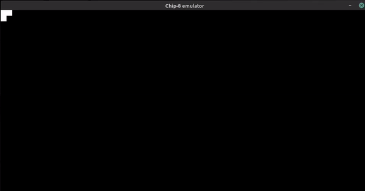

# Chip-8 Emulator

Chip-8 is a simple, interpreted, programming language which was first used on
some do-it-yourself computer systems.

## Games allow on Chip-8 Emulator

Pong, Space Invaders, Tetris, Pac-Man and many more.

Download [Chip-8 games][c8game]

## Requirements

### Linux and macOS only

Prerequisites:

- [Python][python-download]
- [Pygame][pygame-download]
- [Tkinter][tkinter-download]

## Dowload

Run:

    $ sudo apt-get install python3-pygame (Linux)
    $ python3 -m pip install -U pygame --user (MacOS)

## Run

    $ python3 chip8.py

### Windows

Prerequisites:

- [Python][python-download]
- [Pygame][pygame-download]

## Dowload

Run:

    $ pip3 install pygame

## Run

    $ python3 chip8.py

[c8game]: https://www.zophar.net/pdroms/chip8/chip-8-games-pack.html
[pygame-download]: https://www.pygame.org/wiki/GettingStarted
[tkinter-download]: https://docs.python.org/3/library/tkinter.html
